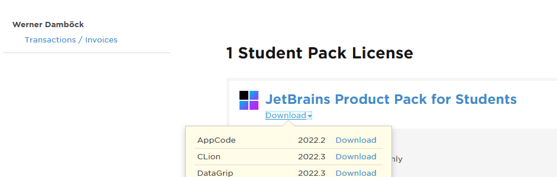
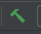

# Demoproject für Arduino mit C-Clion
## Installation C-Lion mit Platform IO
* Info: https://community.platformio.org/t/elf-file-created-by-platformio-does-not-contain-degub-symbol/14871/21?page=2
### Installation C-Lion
* Als Student anmelden beim JetBrains. Die Anmeldung bitte mit der .htlstp.at Adresse!
  >https://www.jetbrains.com/de-de/community/education/#students
* Auf der Jetbrains-Seite mit dem erstellten Login anmelden
* Download von Clion aus der Student-Pack-License am Link Download-Clion
  
* Installation der heruntergeladenen Version von Clion
* Beim ersten Start muss der Account von JetBrains für eine korrekte Lizenzierung angegeben werden.

## Installation Platform-IO für CLion
* Installiere PlatformIO Core ( siehe auch https://platformio.org/install/cli )
  * Herunterladen von https://raw.githubusercontent.com/platformio/platformio-core-installer/master/get-platformio.py
    >curl https://raw.githubusercontent.com/platformio/platformio-core-installer/master/get-platformio.py >get-platformio.py
* Installiere Python Version 3 von https://www.python.org/downloads/
  * wähle Customized Installation und später das Hakerl bei Environment
  * Prüfe ob Python richtig installiert indem du in der Eingabeaufforderung eingibst:
    >py --version
* starte aus dem Verzeichnis wo heruntergeladen wurde in der Eingabeaufforderung:
  >py get-platformio.py
  * Notiere das PlatformIo-Verzeichnis:
    >  z.B.: C:\Users\werne\.platformio\penv\Scripts\platformio.exe
* Lege das PlatformIO scripts Verzeichnis (z.B: \Users\werne\.platformio\penv\Scripts ) in den Standardsuchpfad:
  >System - Erweiterte Systemeinstellungen - Umgebungsvariablen - Systemvariablen - path

## Installation PlatformIO Plugin für Clion
* Download - Bitte auf Clion-Version achten!: https://plugins.jetbrains.com/plugin/13922-platformio-for-clion
* Öffne Clion
  * Strg-Alt-S - Settings
    * Plugins - Install Plugin from Disk
    * select clion-embedded-platformio-xxx.xxx.xx.zip

## Erstelle ein neues Arduino - C - Projekt
* Starte Clion neu
* Erstelle ein neues PlatformIO Projekt
  * new Project
  * Platform-IO
    * Setze Location
    * Setze Arduino-Version die Verwendet werden soll
    * create
* Benenne im Verzeichnis src die Datei main.cpp um in main.ino !!!
* kompiliere mit 
* Erzeuge einen Unterordner proteus mit einer neuen Proteus-Datei
  >Nun sollte das Debuggen funktionieren
* Setzt das Projekte unter Git-Verwaltung:
  >CVS - Create Git Repository

## Laden des kompilierten Programmes auf die Hardware
* kompiliere das Programm
* Wähle in der Run-Configuration: PlatformIO Upload
  
* starte den Upload mit dem grünen Run-Button

## Demoprojekt aus dem Git-Repository auschecken
* Starte CLion
* File - New - Project from Version-Control
  * wähle Git
  * Bei URL trage ein:
    >https://github.com/damboeck/Mega2560-demoprojekt.git
  * Bei Directory wähle ein sinnvolles Zielverzeichnis
  * Drücke den Clone-Button
    * Warte danach bis das Projekt komplett heruntergeladen wurde
    * Falls ein Fenster mit CMake aufgeht schließe dieses mit X
* Rechte Maustaste auf die Datei "platformio.ini" im Project und PlatformIO - Re Init

## Update Software:
#### Update PlatformIO
> pip install -U platformio
#### Update Python pip
> python.exe -m pip install --upgrade pip

## Konfiguriere PlatformIO
> pio home

